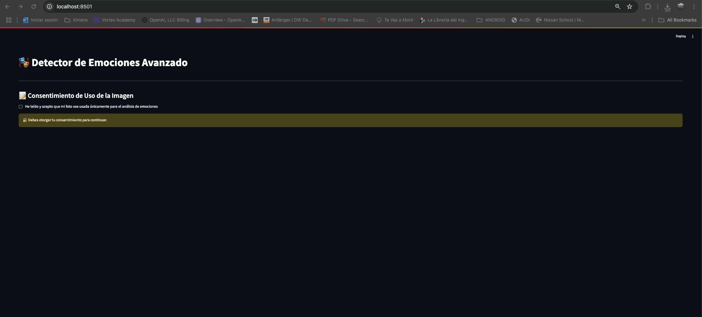
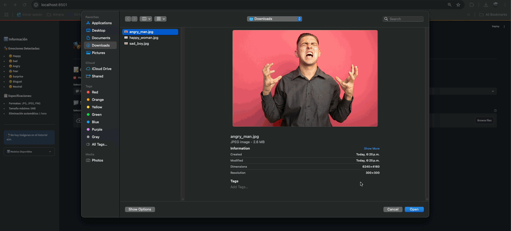

# 🎭 Detector de Emociones - Streamlit App

Esta es una aplicación interactiva construida con [Streamlit](https://streamlit.io/) que permite detectar emociones faciales a partir de una imagen subida o una fotografía capturada con la cámara del dispositivo.

## 🚀 ¿Qué hace esta app?

* 📤 Permite **subir una imagen** (JPG, JPEG, PNG) desde tu dispositivo.
* 📷 También puedes **tomar una foto** con la cámara en tiempo real.
* 🧠 Utiliza la librería **DeepFace** para detectar emociones en los rostros presentes.
* 😊 Muestra los resultados con:

  * Emoji de emoción detectada.
  * Nombre y nivel de confianza.
  * Barra de progreso con la probabilidad de cada emoción.
* 🧼 Tiene un botón para **limpiar resultados** y reiniciar el análisis fácilmente.

---

## 🧠 Modelo de detección de emociones

La app utiliza la librería [DeepFace](https://pypi.org/project/deepface/) para:

* Detectar rostros y obtener regiones (bounding boxes).
* Analizar cada rostro y clasificarlo en una de las 7 emociones básicas.
* No requiere archivo de modelo externo; DeepFace gestiona internamente modelos compatibles (p. ej. 'VGG-Face', 'Facenet').

### Emociones soportadas

| Índice | Emoción  | Emoji |
| ------ | -------- | ----- |
| 0      | Angry    | 😠    |
| 1      | Disgust  | 🤢    |
| 2      | Fear     | 😨    |
| 3      | Happy    | 😊    |
| 4      | Neutral  | 😐    |
| 5      | Sad      | 😢    |
| 6      | Surprise | 😲    |

---

## 🧩 Estructura de funciones

### 🔍 `detect_emotion(image)`

* Usa DeepFace (`DeepFace.analyze`) para detectar rostros y emociones.
* Retorna una lista de resultados por rostro: `bbox`, `emotion`, `confidence`, `prediction`.

### ⭐ `validate_image_file(uploaded_file)`

* Valida extensión y tamaño de la imagen antes de procesar.

### 🎨 `display_results(image, results)`

* Dibuja las caras detectadas en la imagen.
* Muestra la emoción detectada y la distribución de probabilidades.

### 📁 `file_upload()`

* Interfaz para subir una imagen desde el disco.
* Persiste la última imagen subida en `session_state`.

### 📷 `camera_capture()`

* Interfaz para tomar una foto desde la cámara del navegador.
* Persiste la última captura en `session_state`.

### 🧼 `cleanup_temp_files()`

* (Opcional) Limpia archivos temporales creados por la app.

---

## 📦 Requisitos

Instala las dependencias con:

```bash
pip install streamlit opencv-python pillow numpy deepface
```

## ▶️ Cómo ejecutar

1. Asegúrate de tener Python 3.7 o superior.

2. Clona este repositorio o descarga los archivos.

3. Instala las dependencias necesarias con: ```pip install -r requirements.txt```

4. Ejecuta la app:```streamlit run app.py```

## ✏️ Notas adicionales

* DeepFace incluye detección y análisis; no necesitas un modelo `.h5` externo.
* `enforce_detection=False` permite procesar imágenes sin rostros o con detección flexible.

## DEMO

### Aceptar consentimiento



### Historial



### Desde cámara


## 🧠 Referencias

* [📚 DeepFace](https://github.com/serengil/deepface)
* [📘 Documentación de Streamlit](https://docs.streamlit.io/)
* [📷 OpenCV Haar Cascades](https://github.com/opencv/opencv/tree/master/data/haarcascades)
